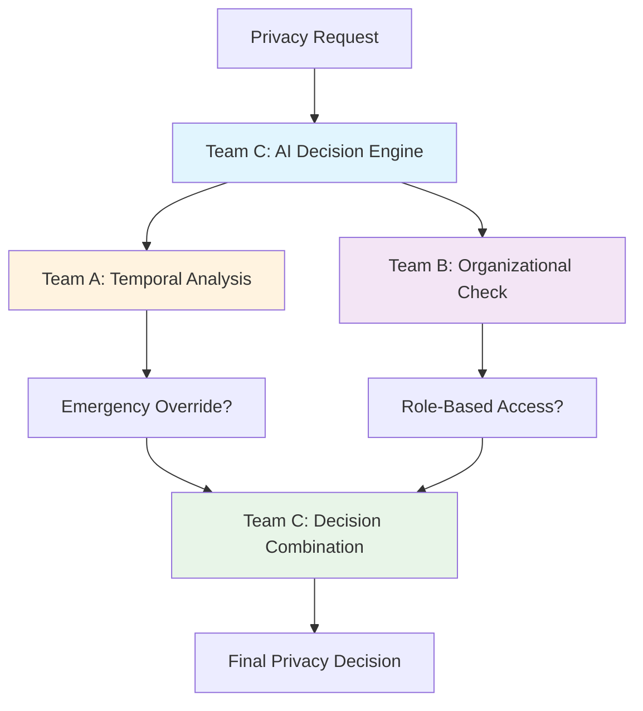

# Multi-Team Privacy Integration System
## Complete Setup and Testing Guide

> **📋 For Someone Who Barely Knows the Project**  
> This guide will walk you through setting up and testing a complete multi-team AI privacy decision system with **zero prior knowledge assumed**.

---

## 🎯 **What This Project Does**

This is a **collaborative AI privacy firewall system** where **3 teams work together** to make intelligent privacy decisions:

- **🕐 Team A (Temporal Framework)** - Makes decisions based on *time, urgency, and emergency situations*
- **🏢 Team B (Organizational Policies)** - Makes decisions based on *employee roles, departments, and company policies*  
- **🧠 Team C (AI Decision Engine)** - *Combines* Team A + Team B decisions using intelligent logic + AI classification

### **Real-World Example:**
> *"Can Dr. Sarah Johnson (Emergency Room) access patient medical records at 2 AM during a cardiac emergency?"*
> 
> - **Team A:** ✅ ALLOW (Emergency + High Urgency)
> - **Team B:** ✅ ALLOW (Doctor role + Medical data access policy)  
> - **Team C:** ✅ **FINAL DECISION: ALLOW** (Emergency Override)

---

## 📁 **Project Structure Overview**

```
graphiti/
├── 🕐 ai_temporal_framework/           # TEAM A: Temporal Framework
├── 🏢 privacy_firewall_integration/   # TEAM B: Organizational Policies  
├── 🧠 ai_privacy_firewall_team_c/     # TEAM C: AI Decision Engine
├── 🛠️ graphiti_core/                  # Core Knowledge Graph Library
├── pyproject.toml                     # Main project dependencies
├── .env.example                       # Environment variables template
└── 📖 MULTI_TEAM_INTEGRATION_GUIDE.md # This file!
```

---

## 🏗️ **Team Folder Structure & Duties Explained**

### **Team A: Temporal Framework Specialists** ⏰

#### **📁 `temporal-framework-feature-temporal-context/`**
- **Purpose:** Feature-specific temporal framework development
- **Status:** Development/Feature branch version
- **Focus:** Enhanced temporal context handling with specific features
- **Key Components:**
  - `core/enricher.py` - Context enrichment for temporal data
  - `core/evaluator.py` - Temporal policy evaluation engine
  - `core/audit.py` - Audit trail management
  - `core/incidents.py` - Emergency incident handling
  - **Unique Features:** Role inheritance, enhanced validation, Team B integration analysis

#### **📁 `ai_temporal_framework/`**
- **Purpose:** Main production temporal framework
- **Status:** Production-ready main framework
- **Focus:** Core 6-tuple contextual integrity system
- **Key Components:**
  - `core/policy_engine.py` - Main temporal policy engine
  - `core/tuples.py` - 6-tuple model implementation
  - `core/optimized_engine.py` - Performance-optimized evaluation
  - **Production Features:** FastAPI integration, containerization, enterprise-ready

#### **🎯 Team A's Duties:**
1. **⏰ Temporal Context Management** - Time-aware privacy decisions
2. **🚨 Emergency Override System** - Medical/emergency access patterns  
3. **📊 6-Tuple Contextual Integrity** - Enhanced access control models
4. **🔍 Policy Evaluation Engine** - Real-time temporal policy decisions
5. **📝 Audit Logging** - Comprehensive temporal audit trails
6. **🔧 Integration Interface** - Direct Python integration for Team C coordination

### **Team B: Organizational Policy Specialists** 🏢

#### **📁 `privacy_firewall_integration/`**
- **Purpose:** Resource-based organizational access control system
- **Status:** Production-ready organizational firewall
- **Focus:** Employee organizational hierarchy and policy enforcement
- **Key Components:**
  - `api/privacy_api.py` - Main organizational API
  - `core/policy_engine_v2.py` - 43 YAML policy engine
  - `core/models.py` - Organizational data models
  - `data/org_data.json` - 65+ organizational entities (1 company, 6 departments, 13 teams, 45 employees)

#### **🎯 Team B's Duties:**
1. **🏢 Organizational Policy Enforcement** - Department/team/role-based access
2. **📋 YAML Policy Engine** - 43 priority-based organizational policies
3. **👥 Employee Management** - Organizational hierarchy and relationships
4. **🗃️ Neo4j Database** - Graph-based organizational data storage
5. **🔐 Resource-Based Access Control** - Employee → Resource permission mapping
6. **⏰ Business Hours Logic** - Time-based organizational restrictions
7. **🧪 Policy Testing** - Comprehensive organizational access testing

### **Team C: AI Decision Integration** 🧠

#### **📁 `ai_privacy_firewall_team_c/`**
- **Purpose:** AI-powered decision combination and semantic classification
- **Status:** Multi-team integration orchestrator
- **Focus:** Combining Team A + Team B decisions intelligently
- **Key Components:**
  - `integration/enhanced_graphiti_privacy_bridge.py` - Multi-team decision bridge
  - `integration/team_b_integration.py` - Team B direct Python integration
  - `ontology/privacy_ontology.py` - AI privacy classification
  - `multi_team_integration_test.py` - Complete system integration test

#### **🎯 Team C's Duties:**
1. **🤖 AI Privacy Classification** - Semantic data field classification
2. **🔗 Multi-Team Integration** - Orchestrating Team A + Team B decisions
3. **🧠 Decision Combination Logic** - Emergency overrides, organizational overrides, consensus
4. **📊 Confidence Scoring** - Combining confidence levels from both teams
5. **🛡️ Final Security Decisions** - Ultimate allow/deny determinations
6. **🧪 Integration Testing** - End-to-end multi-team system validation

### **🔄 How Teams Work Together**

#### **Decision Flow Process:**
```
Privacy Request → Team C (Coordinator)
    ↓
Team C → Team A (Direct Python integration)
    ↓ 
Team C → Team B (Direct Python integration)
    ↓
Team C → Combines decisions with intelligent logic
    ↓
Final ALLOW/DENY Decision
```

#### **Decision Combination Matrix:**
| Team A Result | Team B Result | Emergency | Organizational | **Team C Final** | **Method** |
|---------------|---------------|-----------|----------------|------------------|------------|
| ALLOW         | ALLOW         | -         | -              | **ALLOW**        | consensus_allow |
| DENY          | ALLOW         | YES       | -              | **ALLOW**        | emergency_override |
| ALLOW         | DENY          | -         | YES            | **ALLOW**        | organizational_override |
| DENY          | DENY          | -         | -              | **DENY**         | security_priority |

#### **Integration Patterns:**
- **Team A Integration:** Direct Python integration (simulated Team A responses, no HTTP server needed)
- **Team B Integration:** Direct Python imports (no server needed)
- **Team C Orchestration:** Combines both with intelligent override logic

---

## 🛠️ **Complete Setup Instructions**

### **Step 1: Prerequisites**

You need these installed on your system:

```bash
# Required software
- Python 3.10+ (3.13 recommended)
- Neo4j Database 5.0+
- Git
- uv or pip (for package management)
```

### **Step 2: Clone and Setup Environment**

```bash
# Clone the repository
git clone <repository-url>
cd graphiti

# Create virtual environment (choose one method)
# Method 1: Using uv (recommended)
uv venv
source .venv/bin/activate  # On Windows: .venv\Scripts\activate

# Method 2: Using Python venv
python -m venv .venv
source .venv/bin/activate  # On Windows: .venv\Scripts\activate
```

### **Step 3: Environment Variables Setup**

Create your environment file:

```bash
# Copy the example environment file
cp .env.example .env

# Edit .env with your actual values
nano .env  # Or use any text editor
```

**Required environment variables:**

```bash
# .env file contents
OPENAI_API_KEY=your-openai-api-key-here
NEO4J_URI=bolt://localhost:7687
NEO4J_USER=neo4j  
NEO4J_PASSWORD=your-neo4j-password-here

# Optional (for advanced features)
GROQ_API_KEY=your-groq-api-key-here
ANTHROPIC_API_KEY=your-anthropic-api-key-here
```

### **Step 4: Start Neo4j Database**

```bash
# Method 1: Docker (easiest)
docker run -d \
    --name neo4j-privacy \
    -p 7474:7474 -p 7687:7687 \
    -e NEO4J_AUTH=neo4j/your-password-here \
    neo4j:5.23-community

# Method 2: Local installation
# Download from https://neo4j.com/download/
# Start Neo4j Desktop or run: neo4j start
```

**Verify Neo4j is running:**
- Visit http://localhost:7474
- Login with username: `neo4j`, password: `your-password`

---

## 📦 **Dependencies Installation**

### **Main Project Dependencies**

```bash
# Install core graphiti dependencies
uv sync
# OR
pip install -e .
```

### **Team A (Temporal Framework) Dependencies**

```bash
cd ai_temporal_framework
pip install -r requirements.txt

# Key Team A dependencies:
# - pytest>=7.0
# - PyYAML>=6.0  
# - python-dateutil>=2.8.0
# - neo4j>=5.0.0
```

### **Team B (Organizational Policies) Dependencies**

```bash
cd privacy_firewall_integration
pip install -r requirements.txt

# Key Team B dependencies:
# - graphiti-core>=0.3.0
# - neo4j>=5.0.0
# - python-dotenv>=1.0.0
# - PyYAML>=6.0
# - fastapi>=0.104.0
# - openai>=1.0.0
# - groq>=0.4.0
```

### **Team C (AI Decision Engine) Dependencies**

```bash
cd ai_privacy_firewall_team_c

# Install required packages directly (pyproject.toml has config issues)
pip install fastapi neo4j openai owlready2 pydantic python-dotenv pytz pyyaml requests tenacity uvicorn httpx

# Key Team C dependencies:
# - fastapi>=0.118.0
# - neo4j>=6.0.2
# - openai>=2.0.1
# - owlready2>=0.48 (AI ontology)
# - pydantic>=2.11.9
```

---

## 🗃️ **Database Setup**

### **Load Organizational Data (Team B)**

```bash
cd privacy_firewall_integration

# Load complete organizational structure
python data/load_team_b_data.py

# This creates:
# - 1 company (TechFlow Solutions)
# - 6 departments (Engineering, HR, Finance, Sales, Marketing, Legal)
# - 13 teams within departments  
# - 45 employees with roles and relationships
```

**Verify data loaded correctly:**

```bash
# Run database verification
python query_database.py

# Should show 65+ entities in Neo4j
```

---

## 🧪 **Testing Each Team**

### **🕐 Team A (Temporal Framework) Tests**

```bash
cd ai_temporal_framework

# Run all Team A tests
python -m pytest tests/ -v

# Key test files:
# - tests/test_policy_engine.py       # Core temporal policies
# - tests/test_enhanced_scenarios.py  # Emergency scenarios
# - tests/test_tuples.py             # 6-tuple contextual integrity
```

**Example Team A test:**

```bash
# Test emergency medical scenarios  
python -m pytest tests/test_enhanced_scenarios.py::test_emergency_medical -v
```

### **🏢 Team B (Organizational Policies) Tests**

```bash
cd privacy_firewall_integration

# Run Team B async tests (main integration test)
python test_privacy_firewall_async.py

# Run comprehensive API tests
python test_api_complete.py

# Key test files:
# - test_privacy_firewall_async.py   # Main Team B integration test
# - test_api_complete.py            # REST API functionality  
# - tests/                          # Unit test suite
```

**Example Team B test:**

```bash
# Test organizational access policies
python -c "
import asyncio
from test_privacy_firewall_async import main
asyncio.run(main())
"
```

### **🧠 Team C (AI Decision Engine) Tests**

```bash
cd ai_privacy_firewall_team_c

# Test Team A + Team C integration
python test_team_a_integration.py

# Test comprehensive system integration  
python comprehensive_test.py

# Key test files:
# - test_team_a_integration.py      # Team A + C integration
# - comprehensive_test.py           # Full system test
# - multi_team_integration_test.py  # All teams integration
```

---

## 🚀 **Complete Multi-Team Integration Test**

### **The Main Event: All Teams Working Together**

```bash
cd ai_privacy_firewall_team_c

# Run the complete multi-team integration test
python multi_team_integration_test.py
```

**Expected Output:**
```
🚀 Multi-Team Integration Test
============================================================
Testing: Team A (Temporal) + Team B (Org Policies) + Team C (AI)

📋 Test 1: Medical Emergency Access
   Expected: ALLOW | Actual: ALLOW
   ✅ PASS: Emergency override working

📋 Test 2: HR Employee Data Access  
   Expected: ALLOW | Actual: ALLOW
   ✅ PASS: Organizational override working

📋 Test 3: Cross-Department API Access
   Expected: DENY | Actual: DENY
   ✅ PASS: Security restrictions working

🎯 INTEGRATION STATUS: ✅ ALL TESTS PASSED - Multi-team integration working perfectly!
Success Rate: 100.0%
```

---

## 🔄 **Data Flow Architecture**

### **How the 3 Teams Work Together**



### **Decision Combination Logic**

1. **🚨 Emergency Override** - Team A can override Team B denial in emergencies
2. **🏢 Organizational Override** - Team B can override Team A denial for valid roles  
3. **🤝 Consensus Allow** - Both teams agree → High confidence approval
4. **🔒 Security Priority** - Either team denies → Default to DENY for security

### **Example Decision Flow:**

```
Request: "Can Jennifer Williams (CFO) access salary_info for quarterly review?"

Team A (Temporal): 
├─ Time: 2 PM (business hours) ✅
├─ Emergency: No ❌  
└─ Decision: ALLOW (normal business operation)

Team B (Organizational):
├─ Employee: Jennifer Williams found ✅
├─ Title: Chief Financial Officer ✅  
├─ Data: salary_info ✅
└─ Decision: ALLOW (CFO can access salary data)

Team C (Final):
├─ Team A: ALLOW ✅
├─ Team B: ALLOW ✅
├─ Method: consensus_allow
└─ FINAL: ✅ ALLOW (95% confidence)
```

---

## 📋 **Main Files Reference**

### **🕐 Team A (Temporal) - Key Files**

| File | Purpose |
|------|---------|
| `core/policy_engine.py` | Core temporal policy evaluation engine |
| `core/tuple_models.py` | 6-tuple contextual integrity framework |
| `tests/test_enhanced_scenarios.py` | Emergency and temporal scenario tests |
| `main.py` | Team A standalone server |

### **🏢 Team B (Organizational) - Key Files**

| File | Purpose |
|------|---------|
| `api/privacy_firewall_api.py` | Main Team B privacy firewall API |
| `core/graphiti_client.py` | Neo4j organizational database client |
| `data/load_team_b_data.py` | Organizational data loading script |
| `test_privacy_firewall_async.py` | **Main Team B integration test** |
| `config/policies/` | 43 YAML organizational policy files |

### **🧠 Team C (AI Decision) - Key Files**

| File | Purpose |
|------|---------|
| `integration/enhanced_graphiti_privacy_bridge.py` | **Core multi-team integration logic** |
| `integration/team_a_models.py` | Team A integration models and client |
| `integration/team_b_integration.py` | Team B integration client |
| `ontology/privacy_ontology.py` | AI privacy classification ontology |
| `multi_team_integration_test.py` | **Complete system integration test** |
| `test_team_a_integration.py` | **Team A + C integration test** |

### **🛠️ Core Infrastructure Files**

| File | Purpose |
|------|---------|
| `pyproject.toml` | Main project dependencies and config |
| `.env.example` | Environment variables template |
| `graphiti_core/` | Knowledge graph library (Neo4j abstraction) |

---

## 🐛 **Troubleshooting**

### **Common Issues and Solutions**

#### **Neo4j Connection Failed**
```bash
# Check if Neo4j is running
docker ps | grep neo4j
# OR
neo4j status

# Fix: Start Neo4j
docker start neo4j-privacy
# OR  
neo4j start
```

#### **OpenAI API Key Missing**
```bash
# Error: "Missing OPENAI_API_KEY"
# Fix: Add to .env file
echo "OPENAI_API_KEY=your-key-here" >> .env
```

#### **Team Integration Tests Failing**
```bash
# Check all dependencies installed
cd ai_privacy_firewall_team_c
uv sync

# Check organizational data loaded
cd privacy_firewall_integration  
python query_database.py

# Expected: 65+ entities (1 company, 6 departments, 45 employees)
```

#### **Import Errors**
```bash
# Fix Python path issues
export PYTHONPATH=$PWD:$PYTHONPATH

# OR add to each test script:
import sys
sys.path.append('/path/to/graphiti')
```

---

## 🎯 **Quick Start Checklist**

**For the impatient person who wants to see it working:**

```bash
# 1. Setup (5 minutes)
git clone <repo>
cd graphiti
cp .env.example .env
# Edit .env with your API keys

# 2. Start Neo4j (2 minutes)  
docker run -d --name neo4j-privacy -p 7474:7474 -p 7687:7687 -e NEO4J_AUTH=neo4j/skyber123 neo4j:5.23-community

# 3. Install dependencies (3 minutes)
# Skip main graphiti install (has configuration issues)
cd privacy_firewall_integration && pip install -r requirements.txt
cd ../ai_temporal_framework && pip install -r requirements.txt  
cd ../ai_privacy_firewall_team_c && pip install fastapi neo4j openai owlready2 pydantic python-dotenv pytz pyyaml requests tenacity uvicorn httpx

# 4. Load data (1 minute)
cd ../privacy_firewall_integration
python data/load_team_b_data.py

# 5. Test everything (2 minutes)
cd ../ai_privacy_firewall_team_c
python multi_team_integration_test.py

# 🎉 Expected: 100% success rate!
```

---

## 📞 **Getting Help**

### **Test Results Interpretation**

- **✅ 100% Success Rate** → Perfect! All teams integrated correctly
- **🟡 80%+ Success Rate** → Minor issues, check environment variables  
- **❌ <80% Success Rate** → Major problems, check Neo4j connection and data loading

### **Log Files**

- **Team A logs:** `ai_temporal_framework/logs/`
- **Team B logs:** `privacy_firewall_integration/logs/`  
- **Team C logs:** `ai_privacy_firewall_team_c/logs/`

### **Verification Commands**

```bash
# Check Neo4j has organizational data
cd privacy_firewall_integration
python -c "
import asyncio
from query_database import query_database_entities
asyncio.run(query_database_entities())
"

# Expected output: 65+ entities listed
```

---

## 🎉 **Success Criteria**

**You know everything is working when:**

1. ✅ **Neo4j Database** - Shows 65+ entities (companies, departments, employees)
2. ✅ **Team A Tests** - `pytest tests/` passes with 0 failures  
3. ✅ **Team B Tests** - `test_privacy_firewall_async.py` shows organizational access working
4. ✅ **Team C Tests** - `test_team_a_integration.py` shows Team A+C integration working
5. ✅ **Multi-Team Test** - `multi_team_integration_test.py` shows **100% success rate**

**Final validation command:**

```bash
cd ai_privacy_firewall_team_c
python multi_team_integration_test.py | grep "Success Rate"
# Should output: "Success Rate: 100.0%"
```

---

*🎯 **You're now ready to run a complete multi-team AI privacy decision system!***

**Need more details?** Check the individual README files in each team's folder:
- `ai_temporal_framework/README.md`  
- `privacy_firewall_integration/README.md`
- `ai_privacy_firewall_team_c/README.md`